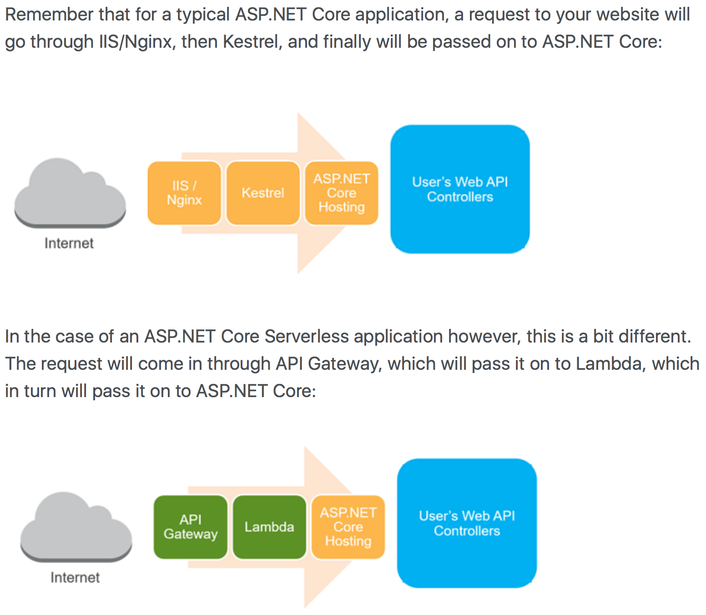
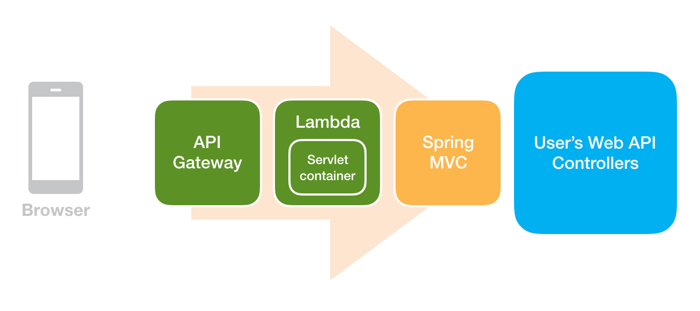
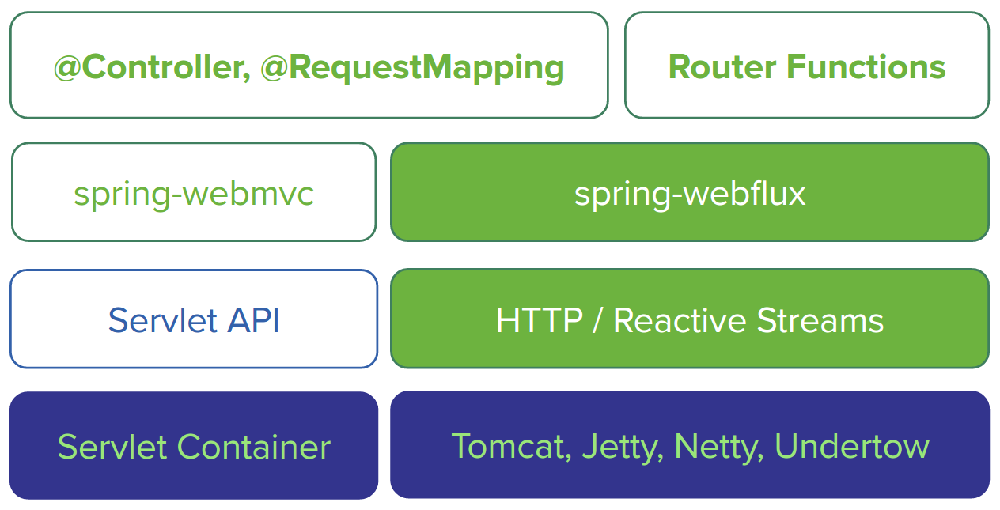
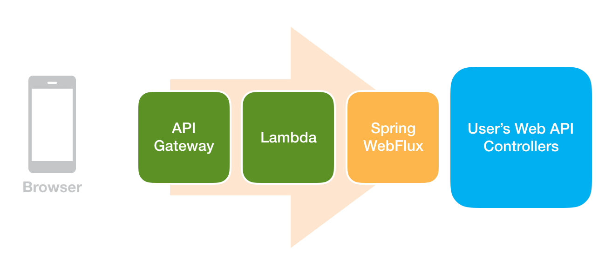
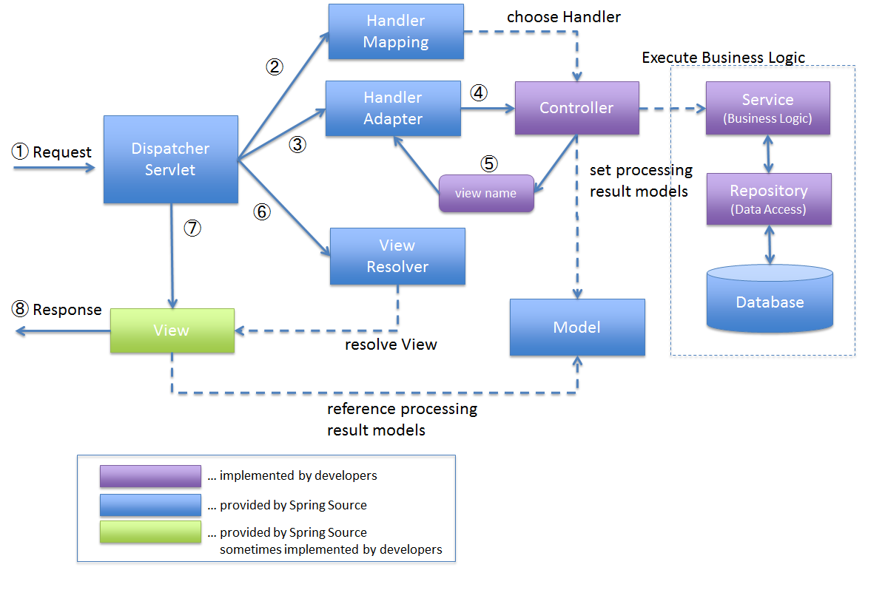
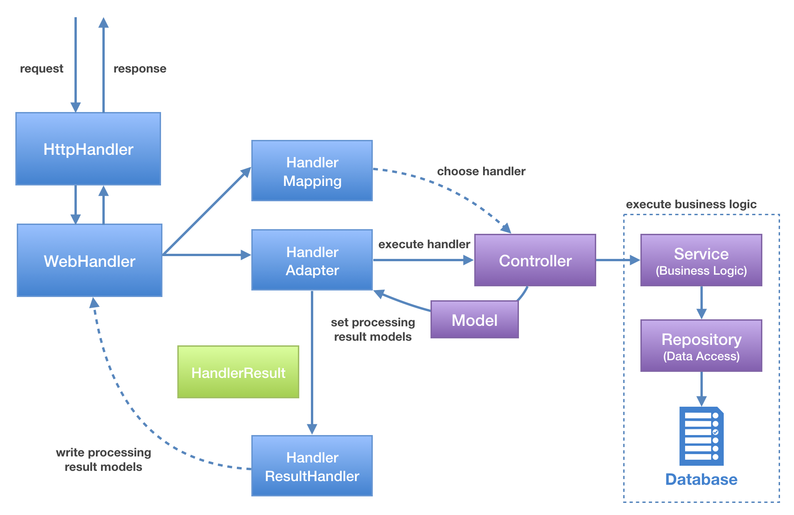
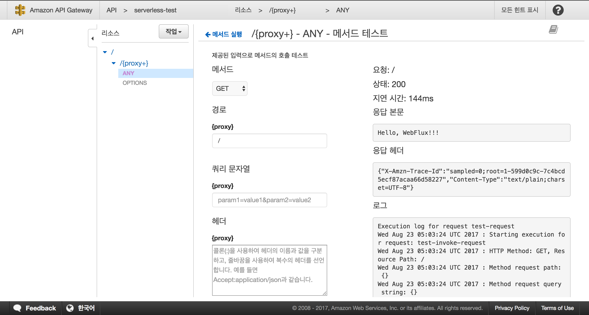

Spring WebFlux 기반 서버리스 애플리케이션 만들어보기
===================================

몇 해 전부터 서버리스(Serverless)라는 단어를 봤지만, 일하는 환경과는 거리가 있는 단어라 깊게 관심을 가지고 찾아본 적은 없었다.
작년부터 AWS 기반에서 시스템을 구축하고, 운영하는 일을 하게 되면서 클라우드 네이티브(Cloud Native)와 서버리스에 대해 관심을 가지고 적극적으로 학습도 하고, 시스템에 적용도 해보는 중이다.

서버리스라는 용어는 다양한 의미로 쓰이고 있는 것으로 보이며, 마틴 파울러 아저씨가 정리하고 있는 [서버리스 아키텍처(Serverless Architectures)](https://martinfowler.com/articles/serverless.html) 글을 통해 어느 정도 감을 잡을 수 있다.

몇일전 .NET Core 2.0 발표 소식을 듣고, 관련 자료들을 뒤적거리다 '[Creating a Serverless Application with ASP.NET Core, AWS Lambda and AWS API Gateway](http://www.jerriepelser.com/blog/aspnet-core-aws-lambda-serverless-application/)' 글에서 꽤 흥미로운 그림을 봤다.



전통적으로 ASP.NET 애플리케이션은 IIS/Nginx -> Kestrel(A cross platform web server for ASP.NET Core) -> ASP.NET Core Hosting 형태에 구조를 띠나, 서버리스 기반에서 애플리케이션을 개발할 때는 IIS/Nginx에 역할을 AWS API Gateway가 수행하고, Kestrel에 역할을 AWS Lambda가 수행하는 형태로 구조를 만든다는 것이다.
역할을 수행하는 도구들이 변경되었음에도 개발자가 작성하는 코드는 전통적인 ASP.NET 애플리케이션을 개발하는 방법 크게 다르지 않아 보인다. ASP.NET Core Hosting이 주어진 상황에 따라 적절하게 대응할 수 있는 유연함을 갖추었기 때문에 이런 구조에 애플리케이션을 개발하는 것이 가능해 보였다.

꽤.. 아니 상당히 매력적인 구조다.
필요에 따라 기반 도구들은 언제든지 변경할 수 있고, 서버리스가 주는 이점들을 충분히 누릴 수도 있기 때문이다.

자바와 스프링으로 위와 같은 구조를 만들 수 있을까?
-----------------------------

당장 머릿속에서 떠오른 구조는 아래와 같다.



Lambda가 서블릿 컨테이너(Servlet container) 가면을 쓰고, API Gateway로부터 입력된 메시지로 HttpServletReqeust와 HttpServletResponse를 만든 후 Spring Web MVC에 전달하면, 요청 처리부터 응답 작성까지 수행하는 형태다.
혹시나 하고 찾아보니 역시 비슷한 생각을 가지고 구현된 오픈소스 [aws-serverless-java-container](https://github.com/awslabs/aws-serverless-java-container)가 있다.

### aws-serverless-java-container

aws-serverless-java-container는 Amazon Web Services - Labs에서 주도적으로 개발하며, 이끄는 프로젝트로 보인다.
AWS Lambda에서 [Spring](https://projects.spring.io/spring-framework/), [Jersey](https://jersey.github.io), [Spark](http://sparkjava.com) 기반 애플리케이션을 작성할 수 있도록 지원해준다.
이슈 목록을 살펴보니 [Apache Camel](http://camel.apache.org), [Play Framework](https://www.playframework.com) 등 다양한 프레임워크들을 지원하기 위해 준비하고 있는 것으로 보인다.

위와 같은 구조가 지금으로선 최선일까?
---------------------

자바로 웹 기반 애플리케이션을 개발하기 위해서는 [서블릿(Servlet)](https://en.wikipedia.org/wiki/Java_servlet)과 [서블릿 컨테이너(Servlet container)](https://en.wikipedia.org/wiki/Web_container#List_of_Servlet_containers)를 사용한다.
물론 네트워크 및 스레드 제어, 요청과 응답 처리 등 바닥부터 쌓아올리면 서블릿과 서블릿 컨테이너를 사용하지 않고도 못만들 이유는 없지만 유지보수성이나 생산성 등을 생각해보면 비효율적이다.
그래서 자바 생태계에 웹 프레임워크(Web Framework)는 대부분 서블릿 위에 추상화 계층을 올리는 형태로 만들어져 있다. (Play Framework는 서블릿과 서블릿 컨테이너를 사용하지 않는다) 이런 상황에서 AWS Lambda가 서블릿 컨테이너 흉내를 내지 않으면, 웹 프레임워크들이 올바르게 동작하지 않을 것이 당연하다.

> [Vert.x](http://vertx.io)도 서블릿과 서블릿 컨테이너 없이 HTTP 기반 애플리케이션을 만들 수 있으나, 성격이 다른 프레임워크라고 생각해서 배제했다.

한데, [마이크로서비스(Microservices)](https://martinfowler.com/articles/microservices.html)를 이어 [리액티브(Reactive)](http://www.reactivemanifesto.org)라는 개념을 중심으로 자바 세상도 빠르게 변하고 있다.
바로 서블릿과 서블릿 컨테이너를 사용하지 않고, HTTP 기반 애플리케이션을 개발을 지원하는 [Ratpack](https://ratpack.io)과 [Spring WebFlux](https://github.com/spring-projects/spring-framework/blob/master/src/docs/asciidoc/web/web-flux.adoc)와 같은 프레임워크들이다.

### Spring WebFlux framework

Spring WebFlux는 Spring Framework 5에 포함된 새로운 웹 애플리케이션 프레임워크다. 기존 Spring MVC 모델에 비동기(asynchronous)와 넌블럭킹 I/O(non-blocking I/O) 처리를 맡기려면 너무 큰 변화가 필요했기 때문에 [리액티브 프로그래밍(Reactive programming)](https://en.wikipedia.org/wiki/Reactive_programming)을 지원하는 새로운 웹 프레임워크를 만들었다고 한다.

Spring MVC와 Spring WebFlux는 다음과 같은 구조로 되어 있다. (이후 MVC와 WebFlux라고 부르겠다)



MVC는 서블릿 컨테이너와 서블릿을 기반으로 웹 추상화 계층을 제공하고, WebFlux는 서블릿 컨테이너(Tomcat, Jetty) 외에도 [Netty](https://netty.io), [Undertow](http://undertow.io)와 같이 네트워크 애플리케이션 프레임워크 위에서 HTTP와 [리액티브 스트림(Reactive Streams)](http://www.reactive-streams.org) 기반으로 웹 추상화 계층을 제공하고 있다.

MVC와 WebFlux 둘다 @Controller, @RequestMapping 형태에 @MVC 모델을 그대로 사용할 수 있다. WebFlux는 [Route Functions](http://docs.spring.io/spring-framework/docs/5.0.0.BUILD-SNAPSHOT/spring-framework-reference/html/web-reactive.html#_routerfunctions)이라는 함수형 프로그래밍 방식에 모델을 추가로 제공한다.

아래 링크는 Spring 5와 WebFlux에 대해 다루는 콘퍼런스 녹화본이다.

> [SpringCamp 2017 - Reactive Spring (Spring 5 & Reactor)](https://www.youtube.com/watch?v=UIrwrW5A2co)
>
> [SpringCmap 2017 - Spring WebFlux](https://www.youtube.com/watch?v=2E_1yb8iLKk)

AWS Lambda에는 서블릿과 서블릿 컨테이너를 사용하지 않는 WebFlux 기반에 웹 애플리케이션이 더 적합하다고 보인다.




WebFlux는 어떻게 동작하나?
------------------

MVC는 다음과 같이 요청과 응답을 처리하고 있다.



서블릿 컨테이너로 들어온 요청이 DispatcherServlet에게 전달되면, DispatcherServlet는 순차적으로 HandlerMapping, HandlerAdapter에게 요청 처리를 위임하고, ViewResolver에게 응답 처리을 위임한다.

WebFlux도 크게 달라지진 않는다. 처리 흐름을 간단하게 도식화해서 보면 아래와 같다.



웹 서버(서블릿 컨테이너, Netty, Undertow)로 들어온 요청이 HttpHandler에게 전달되면, HttpHandler는 전처리 후 WebHandler에게 처리를 위임한다. WebHandler 내부에서는 HandlerMapping, HandlerAdapter, HandlerResultHandler 3가지 컴포넌트가 요청과 응답을 처리한다. 처리가 끝나면 HttpHandler는 후처리 후 응답을 종료한다.
HandlerMapping, HandlerAdapter는 MVC가 사용하는 컴포넌트와 역할과 이름이 같지만, 동작 방식이 다르기 때문에 별도의 인터페이스를 사용한다.

 > MVC:
 > - org.springframework.web.servlet.HandlerMapping
 > - org.springframework.web.servlet.HandlerAdapter
 >
 >
 > WebFlux:
 > - org.springframework.web.reactive.HandlerMapping
 > - org.springframework.web.reactive.HandlerAdapter

MVC와 다른 점은 응답을 처리하는 컴포넌트가 HandlerResultHandler라는 것이다. HandlerResultHandler는 몇 가지 구현체가 제공되는데, 그 중 ViewResolver를 사용하는 ViewResolutionResultHandler가 있다.

Lambda에서 Spring WebFlux를 사용하기
---------------------------------

API Gateway와 Lambda를 통합하는 방법은 AWS 가이드 문서인 [Set up API Gateway Proxy Integration](http://docs.aws.amazon.com/apigateway/latest/developerguide/api-gateway-set-up-simple-proxy.html)에 나와 있다.
중요하게 챙겨봐야 할 부분은 API Gateway를 통과해 Lambda 핸들러가 실행될 때 입력되는 값인 'Input Format of a Lambda Function for Proxy Integration'과 Lambda 핸들러 실행 결과값으로 API Gateway에게 반환할 'Output Format of a Lambda Function for Proxy Integration' 이다. 즉, 요청과 응답 메시지 프로토콜이다.

WebFlux에 진입점인 HttpHandler 인터페이스를 살펴보면, Lambda에서 WebFlux를 사용하는 방법이 보인다.

```java
import reactor.core.publisher.Mono;

public interface HttpHandler {

	/**
	 * Handle the given request and write to the response.
	 * @param request current request
	 * @param response current response
	 * @return indicates completion of request handling
	 */
	Mono<Void> handle(ServerHttpRequest request, ServerHttpResponse response);

}
```

API Gateway에서 도착한 입력값을 ServerHttpRequest로 변환하고, 비어있는 ServerHttpResponse와 함께 HttpHandler에게 넘긴 후 요청 및 응답 처리가 끝나면, ServerHttpResponse를 가공해서 API Gateway가 원하는 형태로 반환해주면 된다.

단순하게 동작하는 수준에서 API Gateway, Lambda, WebFlux를 연동하기 위해 4가지 모델 클래스를 작성했다.

- APIGatewayProxyRequest
- APIGatewayProxyResponse
- SimpleAPIGatewayProxyServerHttpRequest
- SimpleAPIGatewayProxyServerHttpResponse

위 2개 모델은 API Gateway, Lambda를 연동하고, 아래 2개 모델은 WebFlux와 연동하기 위해 작성한 모델이다.
4개 모델 클래스를 사용해서 요청과 응답을 처리하는 간단한 서버리스 애플리케이션을 작성해보면 아래와 같다.

```java
import com.amazonaws.services.lambda.runtime.Context;
import com.amazonaws.services.lambda.runtime.RequestHandler;

import org.springframework.http.server.reactive.HttpHandler;
import org.springframework.http.server.reactive.ServerHttpRequest;
import org.springframework.http.server.reactive.ServerHttpResponse;

import serverless.aws.model.APIGatewayProxyRequest;
import serverless.aws.model.APIGatewayProxyResponse;
import serverless.aws.springframework.http.server.reactive.SimpleAPIGatewayProxyServerHttpRequest;
import serverless.aws.springframework.http.server.reactive.SimpleAPIGatewayProxyServerHttpResponse;


public class SimpleServerlessApplication implements RequestHandler<APIGatewayProxyRequest, APIGatewayProxyResponse> {

    @Override
    public APIGatewayProxyResponse handleRequest(APIGatewayProxyRequest proxyRequest, Context context) {
        APIGatewayProxyResponse proxyResponse = new APIGatewayProxyResponse();

        ServerHttpRequest request = SimpleAPIGatewayProxyServerHttpRequest.of(proxyRequest);
        ServerHttpResponse response = SimpleAPIGatewayProxyServerHttpResponse.of(proxyResponse);

        HttpHandler httpHandler = createHttpHandler(context);
        httpHandler.handle(request, response).block();

        return proxyResponse;
    }

    protected HttpHandler createHttpHandler(Context context) {
        return RouterFunctions.toHttpHandler(
            route(path("/"), request -> ok().syncBody("Hello, WebFlux!!!"))
        );
    }

}
```

원하는 형태로 동작하는지 확인해보기 위해 간단한 방법은 HttpHandler를 생성했다. 작성한 애플리케이션을 Lambda에 배포하고, API Gateway를 통해 테스트해본 결과는 기대했던대로 잘 동작한다.



실제 서비스하는 수준에 애플리케이션은 이렇게 단순하지 않다. 데이터베이스를 비롯한 여러 서비스 컴포넌트들과 컨트롤러들로 구성될 것이다. Spring Boot 기반에 애플리케이션을 만들고 싶다면 어떻게 해야 하는가?

방법은 크게 다르지 않다. 아래와 같이 Spring Boot 기반에 애플리케이션 설정 클래스를 작성하고, SpringApplication을 생성 후 HttpHandle에게 요청과 응답을 위임하고, 그 결과를 반환하면 된다.

```java
@SpringBootConfiguration
@Import({ JacksonAutoConfiguration.class
        , HttpMessageConvertersAutoConfiguration.class
        , CodecsAutoConfiguration.class
        , ReactorCoreAutoConfiguration.class
        , WebFluxAutoConfiguration.class
        , HttpHandlerAutoConfiguration.class
        , PlayerWebConfiguration.class })
public class ServerlessWebApplicationConfiguration {

    @Bean
    public WebFluxConfigurer webFluxConfigurer() {
        return new WebFluxConfigurer() {
            @Override
            public void configureContentTypeResolver(RequestedContentTypeResolverBuilder builder) {
                builder.fixedResolver(MediaType.APPLICATION_JSON);
            }
        };
    }

    @Bean
    public RouterFunction<ServerResponse> rootHandler() {
        return route(path("/"), request -> ok().syncBody("Hello, WebFlux!!!"));
    }

}

public class LambdaEntryPoint implements RequestHandler<APIGatewayProxyRequest, APIGatewayProxyResponse> {

    @Override
    public APIGatewayProxyResponse handleRequest(APIGatewayProxyRequest proxyRequest, Context context) {
        APIGatewayProxyResponse proxyResponse = new APIGatewayProxyResponse();

        ServerHttpRequest request = SimpleAPIGatewayProxyServerHttpRequest.of(proxyRequest);
        ServerHttpResponse response = SimpleAPIGatewayProxyServerHttpResponse.of(proxyResponse);

        HttpHandler httpHandler = createHttpHandler(context);
        httpHandler.handle(request, response).block();

        return proxyResponse;
    }

    protected HttpHandler createHttpHandler(Context context) {
        SpringApplication application = new SpringApplication();
        application.addPrimarySources(Collections.singleton(ServerlessWebApplicationConfiguration.class));
        application.setWebApplicationType(WebApplicationType.REACTIVE);
        application.setApplicationContextClass(GenericReactiveWebApplicationContext.class);

        ApplicationContext applicationContext = application.run();

        return applicationContext.getBean(HttpHandler.class);
    }

}
```

로컬에서 테스트하고 싶다면, 아래와 같이 HttpHandler에게 웹 서버만 제공해주면 된다.

```java
@SpringBootConfiguration
@Import({ ServerlessWebApplicationConfiguration.class, ReactiveWebServerAutoConfiguration.class })
public class LocalEntryPoint {

    public static void main(String[] args) {
        SpringApplication.run(LocalEntryPoint.class, args);
    }

}
```

이쯤에서 끝내기엔 아쉬워서 몇 가지 코드를 더 넣고 샘플 애플리케이션을 만들어보았다.
좋은 형태는 아니지만, WebFlux 코드가 궁금한 분들에겐 구경거리 정도는 될 것이다.

마무리
---

해결해야 할 문제들이 몇 가지 있기는 하지만, 프로토타이핑을 통해 얻은 것들은 만족스럽다.

서버리스가 주는 이점은 꽤 매력적이지만, 마틴 파울러 아저씨의 글에서처럼 서버리스 관련 도구들은 아직 성장기에 있다. 특히 Cold start 와 모니터링에 대한 부분은 명확한 해법이 보이지 않고 있다. 이는 AWS를 비롯해 Google, Azure 등이 좀 더 힘내서 달려주기를 바라고 있다.

WebFlux는 가볍게 접근해서는 꽤 손해볼 타입이다. MVC는 견고한 웹 애플리케이션을 만들기 위한 여러 장치가 준비되어 있어 필요에 따라 다양한 형태의 웹 애플리케이션을 만들 수 있을 성숙한 모델이지만, WebFlux는 자료도 많지 않고, 확장하기 어려운 구간들이 있어 입맛대로 웹 애플리케이션을 구성하는 게 쉽지 않았다.

